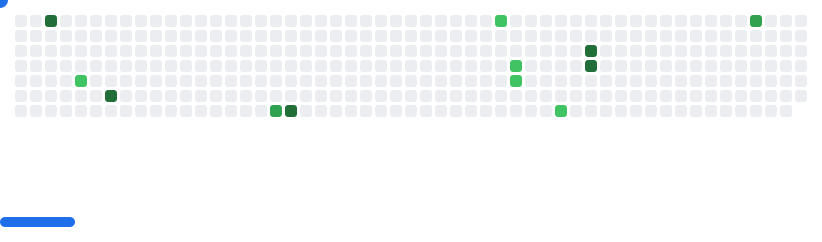

<!-- Elegant Dark Themed GitHub Profile README -->

  
  <h1 style="color:#00CED1; margin-bottom: 0;">Ayush</h1>
  
<i>Robotics & AI Developer — building at the intersection of Automation, AI, and Robotics</i>

  <picture>
    <source media="(prefers-color-scheme: dark)" srcset="images/breakout-dark.svg" />
    <source media="(prefers-color-scheme: light)" srcset="images/breakout-light.svg" />
    
  </picture>

## 👨‍💻 About Me
- 🚀 **Robotics & Generative AI Enthusiast**
- 🔧 Working with **ROS**, **Computer Vision**, **LLMs**
- 🤖 Interests: **Autonomous Systems**, **Intelligent Agents**
- 📬 **[Email Me](mailto:ayush.official1901@gmail.com)**
- 📱 **Phone:** +91 9005956767

## 🌐 Connect With Me

  
  
  
  
  

## 🛠️ Skills & Tools

  <!-- Languages -->
  
  
  
  
  <!-- AI / ML -->
  
  
  
  
  
  
  
  <!-- Frameworks & APIs -->
  
  
  
  <!-- DevOps -->
  
  
  
  
  
  <!-- Robotics -->
  
  
  
  
  <!-- Tools -->
  
  

## 📊 GitHub Analytics

  
  

## 🏆 Holopin Badges

  

<i>“The best way to predict the future is to invent it.”</i>

